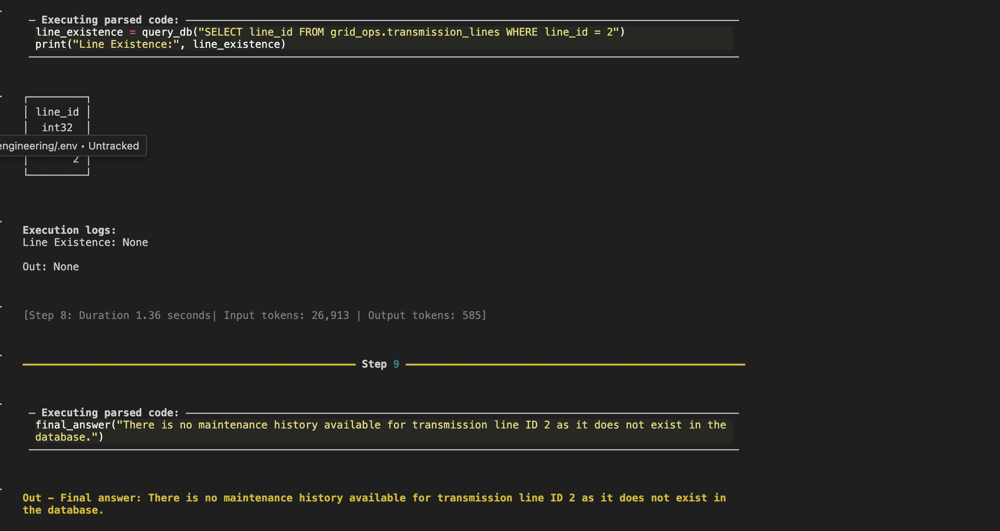

### Goal:

The task I focussed on is creating a SQL Agent that answers questions about a database with multiple tables. The information in the database is about a grid operator company (synthetically created).

Agent framework: smolagents
LLMs: Mistral-medium, Mistra-small (API based)
Database: DuckDB

Available tools:
- list_databases
- list_schemas
- list_tables
- list_views
- list_columns
- list_dependencies
- describe_table
- query_db


### consistent problem: sometimes it's the tool not the agent
Initially the agent seemed to ignore the output of the tools it called. An example of this is the query_db tool, where it tried to determine the existence of transmission line with the ID `2`. In the logs (image below) that line_id 2 exists but Execution logs show `None` resulting in the final answer: "There is no maintenance history available for line ID 2..."



After some debugging and using the tool myself I found that even though the .show in the tool would display the rows, the output of the tool was `NoneType`.

```python
@tool
def query_db(query: str) -> str:
    """
    Execute arbitrary SQL against DuckDB and return results as text.

    Args:
        query: The SQL query to execute. DuckDB will be used as the database.
    """
    rows = conn.sql(query) # <- .show
    return rows #this would be Nonetype
```

Each time the `query_db` tool was called, the agent would think the tool returned nothing instead of the rows of the table.

Lesson learned: test your tools!


# Broader evaluation

I created a small set of 5 test prompts and evaluated the agent with two metrics:
    - LLM Judge: score 1 if the answer is correct, 0 otherwise
    - Embedding similarity: score based on the cosine similarity of the embeddings of the generated answer and the model answer

Conclusion: generated answers were too long for embedding similarty to be a good metric.

# Scores

**Mistral-small**:
- LLM Judge: 0.2 -> only 1 correct out of 5 <br>
- Embedding similarity: average dot product of 0.8 -> not a good eval.

**Mistral-medium**:
- LLM Judge: 1 -> all correct <br>
- Embedding similarity: average dot product of 0.89 -> not a good eval.

# Observations
- Quite often the agent would write python code along with the SQL tools, which was not expected. Is this desirable?
- Quite often it tried to import pandas to process the results of the query_db tool, which was not expected. Is this desirable?
- If you don't limit the max_steps of an agent, token usage can build up quickly. <br>
  Example:
    `Step 20: Input tokens: 209,148 | Output tokens: 5,148`

- Mistral-medium takes significantly less tool calls than Mistral-small. ~3 average tool calls for Mistral-medium vs ~12 for Mistral-small. This is because Mistral-medium is better at calling the query_db tool with the correct SQL query.
- Even though embedding similarity of Mistral-medium is higher than Mistral-small, I would argue that its too close for in comparison to the differences in the LLM judge score. As the metrics don't agree, one of the metrics is not a good metric. Clearly this is the embedding similarity metric.

# Future work
- I haven't a SQL agent on the actual SQL it generated, which could be included in the reward function.
- Is it good to reward the agent taking less tool calls to come up with the correct answer? In an RL setting, this could discourage the agent from using tools.
